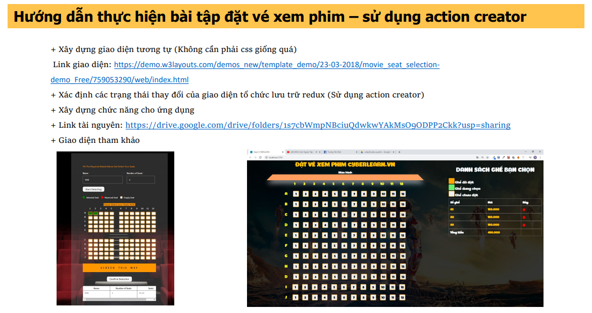

# CYBERSOFT ACADEMY

_(Lớp BootCamp Sáng 12 - Năm 2024 - Khoá Front-End)_

	<picture>
		
	</picture>

## [Buổi 30 - 45] BÀI TẬP REACT - REDUX

# Mục tiêu

1. Tìm hiểu về React.

2. Thực hành với kiến thức Redux.

3. Thiết kế dựa vào layout mẫu. Đề bài:

	<picture>
		
	</picture>

> Bài làm của Trương Thục Vân.

# React + Vite

This template provides a minimal setup to get React working in Vite with HMR and some ESLint rules.

Currently, two official plugins are available:

- [@vitejs/plugin-react](https://github.com/vitejs/vite-plugin-react/blob/main/packages/plugin-react/README.md) uses [Babel](https://babeljs.io/) for Fast Refresh
- [@vitejs/plugin-react-swc](https://github.com/vitejs/vite-plugin-react-swc) uses [SWC](https://swc.rs/) for Fast Refresh
